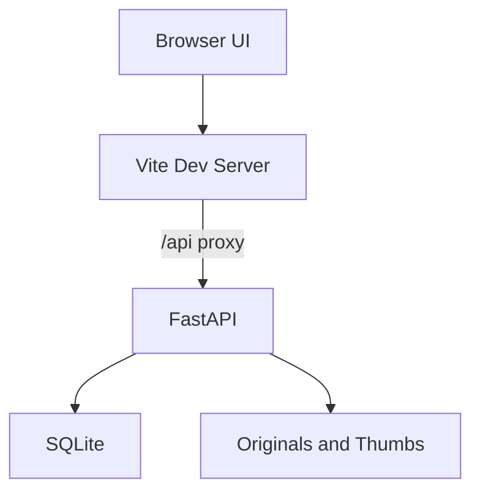

# 架构设计

## 系统概述

ImageVault 采用前后端分离：Vue 3 负责图库界面与灯箱交互，FastAPI 负责图片存储、元数据与检索。Vite 开发服务器通过反向代理把 `/api` 请求转到后端，预览环境只暴露前端端口。

## 技术栈

- 前端：Vue 3、Vite、原生 CSS
- 后端：FastAPI、Uvicorn、SQLAlchemy、Pillow
- 存储：SQLite（元数据）、`backend/data/originals`（原图）、`backend/data/thumbs`（缩略图）

## 项目结构（建议）

```
/workspace
├── backend/                 # FastAPI 服务
│   ├── app/
│   │   ├── main.py          # 应用入口、数据库初始化与迁移
│   │   ├── database.py      # SQLite 连接与列迁移
│   │   ├── models.py        # Image / ImageSet / Category / Tag / Banner 模型
│   │   ├── schemas.py       # 请求响应模型
│   │   ├── image_store.py   # 落盘与缩略图
│   │   └── routers/
│   │       ├── images.py        # 图片、信息流、标签、回收站、统计接口
│   │       ├── sets.py          # 套图创建、详情与回收站接口
│   │       ├── banners.py       # 首页广告图接口
│   │       └── categories.py    # 分类管理接口
│   ├── data/                # 运行时数据（不入库）
│   └── requirements.txt
├── frontend/                # Vue 3 应用
│   ├── src/
│   │   ├── App.vue          # 路由出口
│   │   ├── router.js        # 前台与后台路由
│   │   ├── api.js
│   │   ├── styles.css       # 前台样式
│   │   ├── admin.css        # 后台样式
│   │   ├── components/      # 前台组件
│   │   └── views/
│   │       ├── HomeView.vue         # 首页：广告轮播 + 三列分类卡
│   │       ├── GalleryView.vue      # 分类页：左名称栏 + 右图片列表
│   │       ├── SetDetailView.vue    # 套图详情
│   │       └── admin/               # 后台布局与页面
│   └── vite.config.js
└── start.sh                 # 同时启动前后端
```

## 核心模块/组件

- **ImageStore**：保存原图、生成 JPEG 缩略图、删除磁盘文件
- **ImageAPI**：列表、上传、更新、软删除、回收站、统计与媒体读取
- **CategoryAPI**：分类增删改查与素材计数
- **GalleryView**：前台图库，分类侧栏 + 双列网格 + 分页 + 灯箱
- **AdminLayout**：后台骨架，汉堡菜单侧边栏 + 顶栏标题「素材上传后台」
- **后台页面**：数据看板、分类管理、素材上传、素材管理、回收站

## 架构图



## 关键流程

1. 用户拖入图片，前端以 `multipart/form-data` 调用上传接口。
2. 后端校验 MIME 与扩展名，写入原图，Pillow 生成最长边 480px 的缩略图，记录宽高与标签。
3. 图库页请求分页列表，卡片使用缩略图地址。
4. 点击卡片打开灯箱，按当前筛选结果在列表中前后切换。
5. 后台删除图片时写入 `deleted_at` 形成软删除，进入回收站。
6. 回收站恢复时清空 `deleted_at`，彻底删除或清空回收站时移除磁盘文件与数据库记录。
7. 分类删除后，其下素材的 `category_id` 置空，素材保留为未分类。
8. 上传套图时创建 `ImageSet`，成员图片写入 `set_id`，第一张作为 `cover_image_id`。
9. 前台信息流合并单图与套图：单图点击开灯箱，套图点击跳转 `/set/{id}` 详情页。
10. 套图详情采用沉浸封面 + 上圆角内容层，封面取套图第一张图。
11. 首页顶部轮播来自 `Banner`，点击按 `link` 跳站内路由或外部链接。
12. 首页分类卡封面取该分类下最新素材的缩略图，无素材时回退到套图封面。
13. 上传时额外生成 20px 的 base64 占位图（`placeholder`），前端先模糊显示占位图再渐入缩略图/原图。

## 设计决策

- 第一版无登录：单用户本地图库，降低使用成本。
- 前台以底部双标签组织：首页负责广告与分类入口，分类页负责按分类浏览。
- 广告图独立建模：与图片素材解耦，支持排序与启用状态，便于运营。
- 前台与后台分离：前台只读浏览，广告、分类与上传等写操作集中在 `/admin`。
- 图片占位内联存储：占位图以 base64 存在数据库，前端零额外请求即可实现 blur-up。
- 交互组件独立：`SmartImage` 负责骨架屏与 blur-up，`MediaCard` 负责 hover/长按浮层，`Lightbox` 负责手势与信息面板。
- 单图与套图分离：`Image.set_id` 为空即单图，套图成员不单独进入前台信息流。
- 信息流统一排序：单图与套图按创建时间合并分页，前台展示一致。
- 软删除与回收站：套图软删除会级联标记成员，恢复与彻底删除同步处理。
- 分类与标签分离：分类为受管的一对多归类，标签为自由关键词。
- 元数据与文件分离：SQLite 便于检索，磁盘便于直接提供媒体流。
- 缩略图独立存储：网格加载更轻，灯箱再拉原图。
- 启动时列迁移：`run_migrations` 为旧库补齐新增列，保留既有数据。
- 前端反向代理 `/api`：适配只暴露单端口的预览环境。
