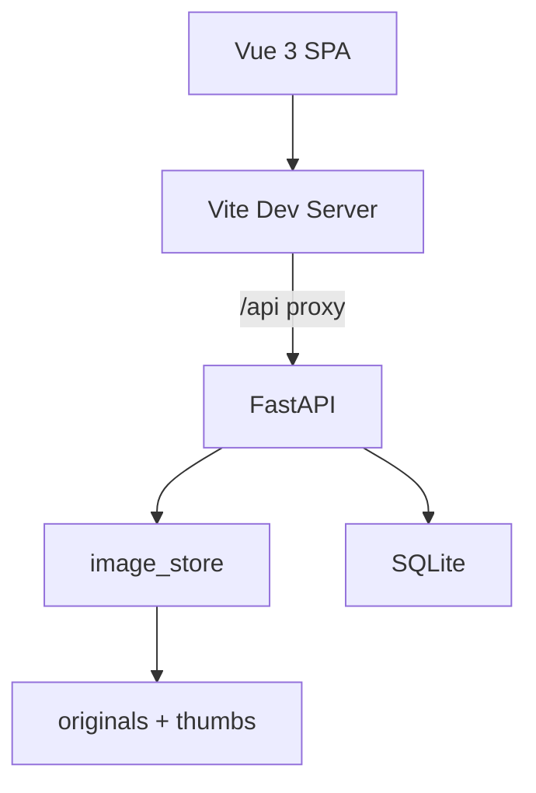
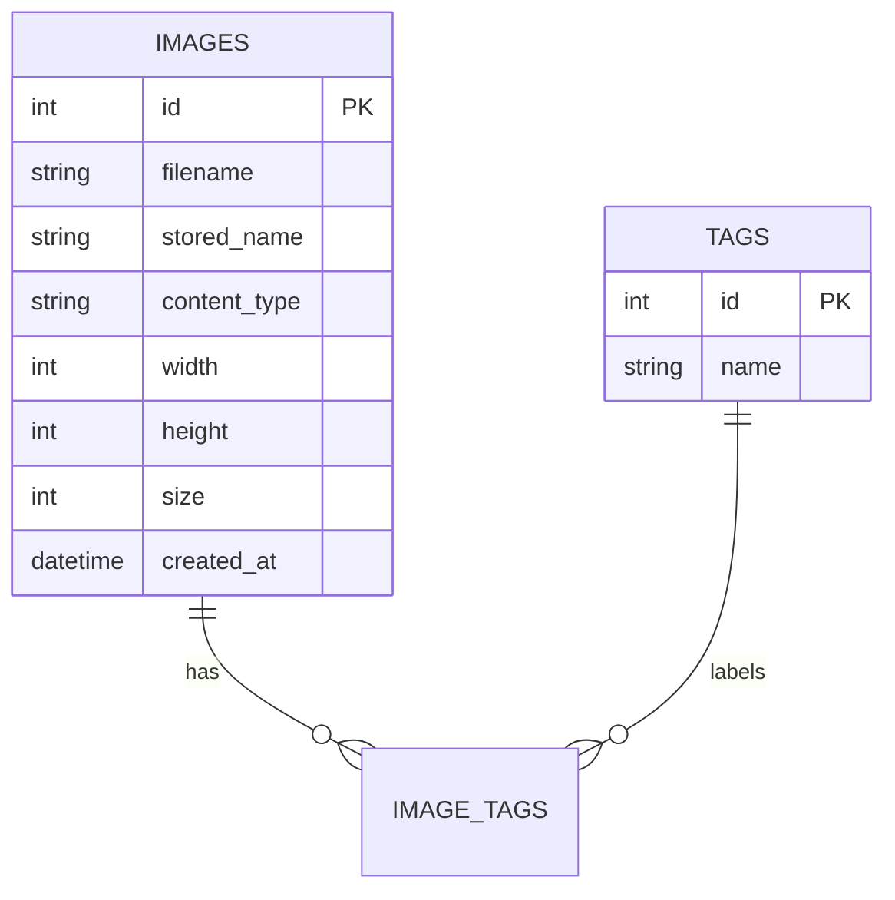

# ImageVault

Feature Name: image-gallery
Updated: 2026-09-18

## Description

ImageVault 是一个前后端分离的单用户在线图库。前端以薄荷绿移动端风格呈现：左侧图标分类栏、顶部胶囊搜索栏、右侧双列缩略图网格与分页控件；点击缩略图进入支持缩放、拖拽和键盘切换的灯箱。后端基于 FastAPI 提供上传、列表、标签、删除与媒体读取接口，图片文件与 SQLite 元数据分离存储。

## Architecture

## Components and Interfaces

前端组件：

- `TopBar`：胶囊搜索框、上传入口，输入防抖 320ms 后触发 `search`
- `SideNav`：全部/标签分类圆形图标，触发 `select`、`all`、`upload`
- `GalleryGrid`：双列卡片网格，展示缩略图、文件名、尺寸与标签，支持多选
- `Pagination`：以当前页为中心最多展示 3 个页码
- `Lightbox`：全屏预览，滚轮缩放、指针拖拽、方向键与 Escape 键处理
- `Uploader`：拖拽/选择多文件、标签输入、逐项移除与上传进度状态

后端模块：

- `routers/images.py`：全部 `/api` 接口
- `image_store.py`：类型与大小校验、Pillow 缩略图生成、文件删除
- `models.py`：`Image` 与 `Tag` 多对多关系
- `schemas.py`：Pydantic 请求与响应模型

## Data Models

## Correctness Properties

1. `stored_name` 全局唯一，原图与缩略图路径均由该名称派生
2. 列表总数与筛选条件一致，分页偏移为 `(page - 1) * limit`
3. 删除图片时磁盘文件与数据库记录同时移除
4. 标签按名称复用，不产生重复记录

## Error Handling

| 场景 | 状态码 | 处理 |
|------|--------|------|
| 不支持的 MIME 类型 | 400 | 返回 Unsupported image type |
| 文件超过 20MB | 413 | 返回大小超限提示 |
| 无法解析的图片 | 400 | 返回 File is not a readable image |
| 图片不存在 | 404 | 返回 Image not found |
| 原图/缩略图缺失 | 404 | 返回 File missing |

前端在 `api.js` 统一解析 `detail` 字段，并通过顶部 toast 提示错误。

## Test Strategy

- 后端：使用 FastAPI TestClient 覆盖上传、列表分页、标签筛选、更新、删除接口，并验证磁盘文件同步移除
- 前端：以手动验收为主，覆盖双列布局、分页边界、灯箱键盘操作和空状态
- 集成：构建前端产物后启动后端，验证 `/api` 代理链路与媒体读取
