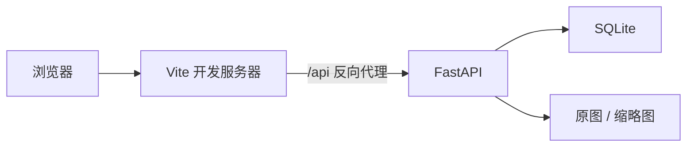
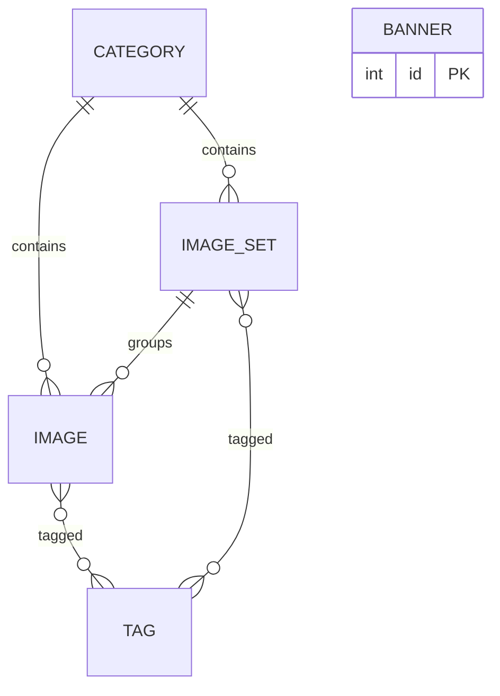

# ImageVault

一个前后端分离的图片素材库，支持**单图与套图**、**分类与标签**、**首页广告轮播**、**沉浸式灯箱预览**与**素材上传后台**。界面按手机 / 平板 / 电脑三端适配。

前后端已分离：Vue 3 负责界面与交互，FastAPI 负责存储、检索与图片处理，前端通过 Vite 反向代理访问 `/api`。

## 功能

### 前台

- **首页**：顶部 2:1 通栏广告轮播（自动播放、拖拽/滑动切换、指示点），下方分类卡片按 3 / 4 / 5 / 6 列自适应
- **分类页**：搜索栏吸顶，左侧分类名称栏固定，右侧图片信息流支持分页；单图点击开灯箱，套图点击进入详情
- **套图详情**：沉浸式封面 + 上圆角内容层，成员图片网格；电脑端自动切换为左右分栏
- **灯箱预览**：双击缩放、移动端双指捏合、滚轮缩放、拖拽平移、滑动切换、底部胶片条、图片信息面板与原图下载
- **图片加载**：上传时生成微型占位图，先模糊显示再渐入清晰图；无占位图时显示骨架屏

### 后台（`/admin`）

- **数据看板**：单图 / 套图 / 分类 / 标签数量、存储占用、回收站数量、分类分布与最近上传
- **广告图管理**：批量上传、标题、跳转链接、排序、启用 / 停用
- **分类管理**：新增、编辑、删除、排序，支持上传分类封面（未设置时自动取该分类最新素材缩略图）
- **素材上传**：单图 / 套图两种模式，套图以第一张图片作为封面
- **素材管理**：搜索、分类筛选、重命名、改分类、改标签、批量移动、批量删除
- **回收站**：单图与套图分区展示，支持恢复、彻底删除、清空

## 技术栈

| 层 | 技术 |
|----|------|
| 前端 | Vue 3、Vite 6、vue-router 4、原生 CSS（Design Token） |
| 后端 | FastAPI、Uvicorn、SQLAlchemy 2.0、Pillow |
| 存储 | SQLite（元数据）+ 本地磁盘（原图 / 缩略图） |
| 图片处理 | Pillow 生成 480px 缩略图与 20px base64 占位图 |

## 架构





- **单图**：`Image.set_id` 为空
- **套图**：`ImageSet` 聚合多张 `Image`，`cover_image_id` 指向第一张
- **软删除**：删除写入 `deleted_at`，进入回收站；彻底删除时才清理磁盘文件

## 项目结构

```
imagevault/
├── backend/
│   ├── app/
│   │   ├── main.py            # 应用入口、数据库初始化与迁移
│   │   ├── database.py        # SQLite 连接与启动时列迁移
│   │   ├── models.py          # Image / ImageSet / Category / Tag / Banner
│   │   ├── schemas.py         # 请求响应模型
│   │   ├── image_store.py     # 落盘、缩略图与占位图
│   │   ├── common.py          # 标签复用
│   │   └── routers/
│   │       ├── images.py      # 图片、信息流、回收站、统计
│   │       ├── sets.py        # 套图
│   │       ├── categories.py  # 分类与分类封面
│   │       └── banners.py     # 首页广告图
│   ├── requirements.txt
│   └── data/                  # 运行时数据（已加入 .gitignore）
├── frontend/
│   ├── src/
│   │   ├── api.js             # 接口封装与媒体地址
│   │   ├── router.js          # 前台与后台路由
│   │   ├── styles.css         # 设计 token 与前台基础样式
│   │   ├── admin.css          # 后台样式与响应式规则
│   │   ├── components/        # SmartImage / MediaCard / Lightbox 等
│   │   └── views/
│   │       ├── HomeView.vue
│   │       ├── GalleryView.vue
│   │       ├── SetDetailView.vue
│   │       └── admin/         # 后台布局与页面
│   ├── index.html
│   ├── vite.config.js
│   └── package.json
├── .monkeycode/               # 项目文档与需求/设计规格
├── start.sh                   # 一键启动前后端
└── README.md
```

## 快速开始

环境要求：Node.js 18+、Python 3.10+

```bash
# 安装后端依赖
pip3 install --break-system-packages -r backend/requirements.txt

# 安装前端依赖
cd frontend && npm install && cd ..

# 同时启动前后端
bash start.sh
```

也可分开启动：

```bash
# 后端（8000）
python3 -m uvicorn app.main:app --host 0.0.0.0 --port 8000 --app-dir backend
```

```bash
# 前端（5173）
npm --prefix frontend run dev
```

打开 `http://localhost:5173` 访问前台，`http://localhost:5173/admin/dashboard` 进入后台。前端 `/api` 请求由 Vite 代理到后端 8000 端口。

## 接口概览

所有接口以 `/api` 为前缀，完整说明见 [`.monkeycode/docs/INTERFACES.md`](.monkeycode/docs/INTERFACES.md)。

| 分组 | 主要端点 |
|------|----------|
| 信息流 | `GET /api/feed`（单图与套图统一分页） |
| 图片 | `GET/POST /api/images`、`PATCH/DELETE /api/images/{id}`、`POST /api/images/batch-delete`、`POST /api/images/batch-move` |
| 套图 | `GET/POST /api/sets`、`GET/PATCH/DELETE /api/sets/{id}`、`POST /api/sets/{id}/restore` |
| 分类 | `GET/POST /api/categories`、`PATCH/DELETE /api/categories/{id}`、`POST/DELETE /api/categories/{id}/cover` |
| 广告图 | `GET/POST /api/banners`、`PATCH/DELETE /api/banners/{id}` |
| 回收站 | `GET /api/images/trash`、`GET /api/sets/trash`、`POST /api/trash/empty` |
| 媒体 | `GET /api/media/{original\|thumb}/{id}`、`GET /api/media/banner{,-thumb}/{id}` |
| 统计 | `GET /api/stats` |

## 配置说明

| 项 | 值 | 位置 |
|----|----|------|
| 单文件大小上限 | 20 MB | `backend/app/image_store.py` |
| 支持格式 | JPG / PNG / WEBP / GIF / BMP | `backend/app/image_store.py` |
| 缩略图最长边 | 480 px | `backend/app/image_store.py` |
| 占位图最长边 | 20 px | `backend/app/image_store.py` |
| 数据库与文件目录 | `backend/data/` | `backend/app/database.py` |

## 设计规范

整体采用「画廊中性风，图像优先」：界面以黑白灰中性色为主，让图片成为主视觉；品牌绿 `#26794b` 作为唯一强调色，用于选中态、主按钮与指示条。断点统一为手机 `<768px`、平板 `768–1023px`、电脑 `≥1024px`。详细 token 与规则见 [`.monkeycode/docs/DEVELOPER_GUIDE.md`](.monkeycode/docs/DEVELOPER_GUIDE.md)。

## 文档

- [项目概述](.monkeycode/docs/INDEX.md)
- [架构设计](.monkeycode/docs/ARCHITECTURE.md)
- [接口定义](.monkeycode/docs/INTERFACES.md)
- [开发指南](.monkeycode/docs/DEVELOPER_GUIDE.md)

## 待办

- 暗色模式与强调色主题
- 共享元素转场、删除撤销提示
- 看板趋势图与上传进度条
- 拖拽排序（分类、广告图、套图封面）
